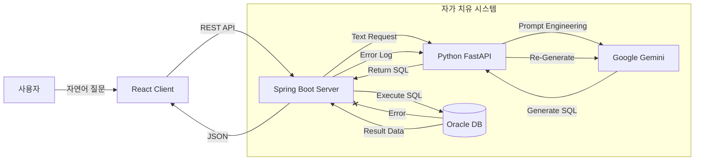

# 🏭 Intelli-ERP: AI 기반 지능형 자원 관리 시스템

> **"복잡한 SQL 없이, 자연어로 대화하는 차세대 ERP"**

---

## 📖 프로젝트 소개 (Project Overview)

**Intelli-ERP**는 전통적인 ERP 시스템의 복잡한 UI와 SQL 접근 장벽을 해결하기 위해 개발된 **AI 챗봇 기반의 데이터 조회 시스템**입니다.

사용자가 "가격이 5만원 이상인 자재 알려줘"와 같이 자연어로 질문하면, 시스템 내부의 **LLM(Large Language Model)** 엔진이 이를 분석하여 자동으로 SQL을 생성하고, 데이터베이스에서 정확한 정보를 찾아 표(Table) 형태로 시각화해 줍니다. 특히 **자가 치유(Self-Correction)** 메커니즘을 탑재하여, AI가 잘못된 쿼리를 생성하더라도 스스로 에러를 감지하고 수정하여 재실행하는 안정성을 갖췄습니다.

---

## 💡 핵심 문제 해결 (Problem & Solution)

### 🔴 문제점 (Problem)

1. **높은 진입 장벽:** 현업 담당자가 DB 데이터를 조회하려면 복잡한 메뉴를 찾거나 SQL을 배워야 함.
2. **경직된 조회:** "특정 조건"의 데이터를 보고 싶을 때마다 개발자에게 쿼리 요청을 해야 함.
3. **AI의 환각(Hallucination):** 일반적인 LLM은 없는 테이블을 참조하거나, 실행 불가능한 쿼리를 짜는 경우가 많음.

### 🟢 해결책 (Solution)

1. **Text-to-SQL 엔진:** Google Gemini API와 LangChain을 활용하여 자연어를 오라클 SQL로 실시간 변환.
2. **Hybrid Architecture:** 프론트(React) - 백엔드(Spring Boot) - AI(Python)의 유기적 연동.
3. **자가 치유 (Self-Correction) 로직:**
* 쿼리 실행 실패(Oracle Error) 감지 시, 에러 로그를 다시 AI에게 전송.
* AI가 에러 원인을 분석하여 쿼리를 수정(Fix) 후 재실행 -> **사용자에게는 성공 결과만 전달.**


---

## 🛠️ 시스템 아키텍처 (Architecture)

### 🏗️ Flow Chart



### 🧱 Tech Stack

* **Frontend:** React, Vite, Axios
* **Backend:** Java 17, Spring Boot 3.x, JPA, JdbcTemplate, RestTemplate
* **AI Server:** Python 3.12, FastAPI, LangChain, Google Gemini-1.5-Flash
* **Database:** Oracle Database (Xe/Enterprise)

---

## 📂 폴더 구조 (Folder Structure)

```bash
Intelli-ERP-Project
├── 📂 Intelli-ERP          # [Backend] Java Spring Boot
│   ├── src/main/java/com/bogeun/erp
│   │   ├── controller      # AiController.java (API 엔드포인트)
│   │   ├── service         # AiService.java (자가 치유 로직 핵심)
│   │   ├── config          # WebConfig (CORS), AppConfig (RestTemplate)
│   │   └── domain          # Entity (Z_MARA 등)
│   └── resources           # application.properties (DB 설정)
│
├── 📂 ai-server            # [AI Core] Python FastAPI
│   ├── main.py             # FastAPI 앱, LangChain 프롬프트, /ask, /fix
│   ├── .env                # Gemini API Key 보안 저장
│   └── venv                # 가상환경
│
└── 📂 frontend             # [Frontend] React
    ├── src/App.jsx         # 채팅 UI, 비동기 통신(fetch), 동적 테이블 렌더링
    └── package.json        # 의존성 관리

```

---

## 🚀 실행 방법 (How to Run)

### 1. 환경 설정 (Prerequisites)

* Java 17+, Python 3.11+, Node.js 18+
* Oracle DB 설치 및 테이블(`Z_MARA` 등) 생성

### 2. AI 서버 실행 (Python)

```bash
cd ai-server
python -m venv venv
./venv/Scripts/activate
pip install -r requirements.txt  # (fastapi, uvicorn, langchain-google-genai 등)
python -m uvicorn main:app --reload

```

### 3. 백엔드 실행 (Spring Boot)

* IntelliJ IDEA에서 `IntelliErpApplication` 실행
* 또는 `./gradlew bootRun`

### 4. 프론트엔드 실행 (React)

```bash
cd frontend
npm install
npm run dev

```

### ⚡ 간편 실행 (Windows)

* 프로젝트 루트의 `start_all.bat` 파일을 더블 클릭하면 3개의 서버가 동시에 실행됩니다.

---

## 💻 실행 화면 (Screenshots)


---

## 🔮 향후 개선 계획 (Future Improvements)

* **RAG (검색 증강 생성) 도입:** 사내 규정 PDF 문서를 학습시켜 질문에 답변하는 기능 추가.
* **음성 인터페이스 (STT/TTS):** 타이핑 없이 말로 질문하고 음성으로 답변 듣기.
* **보안 강화:** Spring Security 및 JWT를 도입하여 사용자별 접근 권한 제어.
* **Docker 배포:** 모든 서비스를 컨테이너화하여 클라우드 환경 배포.

